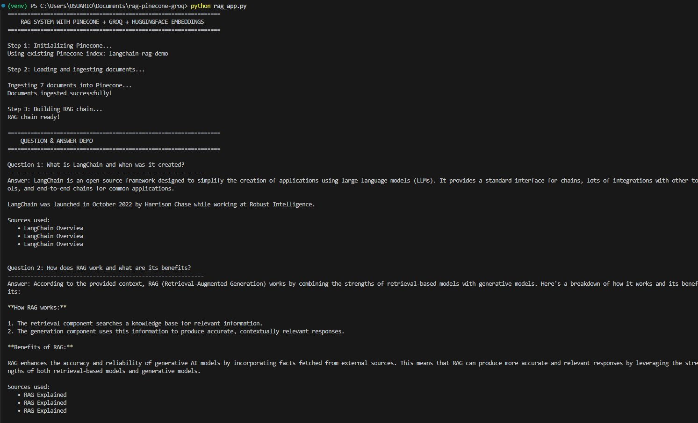
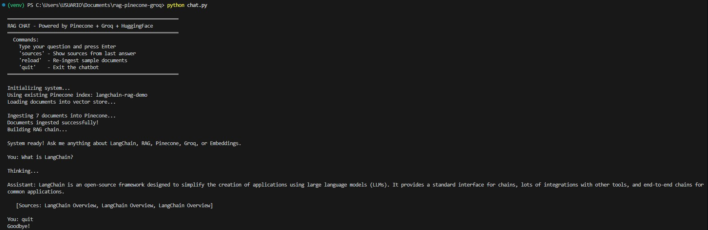
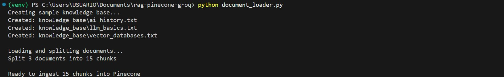

# RAG System with LangChain + Pinecone + Groq

**Student:** Laura Natalia Perilla Quintero

A fully functional **Retrieval-Augmented Generation (RAG)** system built with LangChain. Uses **Pinecone** as vector database, **HuggingFace** sentence-transformers for free local embeddings, and **Groq** for fast, free LLM inference.

> **100% Free** — No paid APIs required. All services have generous free tiers.

---

## Note on Tool Selection (OpenAI → Free Alternatives)

The original lab specification calls for **OpenAI** for both the LLM and embeddings. This implementation uses functionally equivalent **free alternatives** instead:

| Lab Requirement | This Implementation | Reason |
|----------------|---------------------|--------|
| OpenAI LLM (GPT-4) | **Groq** (`llama3-8b-8192`) | Free tier, no credit card needed; extremely fast inference via custom LPU hardware |
| OpenAI Embeddings (`text-embedding-ada-002`) | **HuggingFace** (`all-MiniLM-L6-v2`) | 100% free, runs locally, no API key needed, 384-dim vectors |
| Pinecone | **Pinecone**  | Used exactly as specified |
| LangChain | **LangChain + LCEL**  | Used exactly as specified |

**Why the switch?** OpenAI requires a paid API key with active billing. Groq and HuggingFace achieve the **same RAG architecture** — the pipeline (document ingestion → embedding → vector search → LLM generation) is identical. The LangChain abstraction layer means the code structure is essentially the same as it would be with OpenAI; only the provider changes.

---

## Architecture

```
┌────────────────────────────────────────────────────────────────┐
│                         RAG PIPELINE                           │
│                                                                │
│  INGESTION (one-time)                                          │
│  ─────────────────────────────────────────────────────────    │
│  Documents → Text Splitter → HuggingFace Embeddings            │
│                                    │                           │
│                                    ▼                           │
│                            Pinecone (Vector DB)                │
│                                                                │
│  QUERY (per question)                                          │
│  ─────────────────────────────────────────────────────────    │
│                                                                │
│  User Question                                                 │
│       │                                                        │
│       ├─── HuggingFace Embeddings ──► Pinecone Similarity ─┐  │
│       │         (embed question)     Search (top-k docs)    │  │
│       │                                                     ▼  │
│       └──────────────────────────► LangChain RAG Chain ────►  │
│                                    (Prompt + Context)          │
│                                          │                     │
│                                          ▼                     │
│                                    Groq LLM (llama3)           │
│                                          │                     │
│                                          ▼                     │
│                                    Final Answer + Sources      │
└────────────────────────────────────────────────────────────────┘
```

---

## Components

| Component | Tool | Notes |
|-----------|------|-------|
| **Vector Database** | Pinecone | Free Starter tier (1 index, 2GB) |
| **Embeddings** | HuggingFace `all-MiniLM-L6-v2` | 100% free, runs locally, no API key |
| **LLM** | Groq `llama3-8b-8192` | Free tier, very fast LPU inference |
| **Framework** | LangChain + LCEL | Orchestrates the full pipeline |
| **Text Splitting** | `RecursiveCharacterTextSplitter` | Optimal chunk sizes for retrieval |

---

## Project Structure

```
langchain-rag-pinecone/
├── rag_app.py           
├── document_loader.py   
├── chat.py              
├── requirements.txt     
├── .env.example         
└── README.md           
```

---

## Installation & Setup

### 1. Clone the repository

```bash
git clone https://github.com/Lanapequin/rag-pinecone-groq.git
cd langchain-rag-pinecone
```

### 2. Create a virtual environment

```bash
python -m venv venv

# Windows
venv\Scripts\activate

# macOS/Linux
source venv/bin/activate
```

### 3. Install dependencies

```bash
pip install -r requirements.txt
```

> The first run will download the HuggingFace embedding model (~80MB). This is automatic and only happens once.

### 4. Get Free API Keys

#### Groq API Key (Free LLM)
1. Go to [https://console.groq.com/](https://console.groq.com/)
2. Sign up for free
3. Go to **API Keys** → **Create API Key**
4. Copy your key

#### Pinecone API Key (Free Vector DB)
1. Go to [https://app.pinecone.io/](https://app.pinecone.io/)
2. Sign up for free (no credit card needed)
3. Go to **API Keys** → copy your key
4. The free **Starter** plan includes: 1 project, 1 index, 2GB storage

### 5. Configure environment variables

```bash
cp .env.example .env
```

Edit `.env` with your keys:
```env
GROQ_API_KEY=gsk_xxxxxxxxxxxxxxxxxxxx
PINECONE_API_KEY=xxxxxxxx-xxxx-xxxx-xxxx-xxxxxxxxxxxx
```

---

## Running the Code

### Option 1 — Run the Q&A demo (`rag_app.py`)

```bash
python rag_app.py
```

This will:
1. Connect to Pinecone and create the index if it doesn't exist
2. Ingest 7 sample documents about LangChain, RAG, Pinecone, Groq, and Embeddings
3. Run 5 preset questions and display answers with their sources

**Screenshot — demo in action:**



> The system correctly answers questions about LangChain, RAG, Pinecone, and HuggingFace embeddings, citing the exact source documents used to generate each answer.

---

### Option 2 — Interactive chat (`chat.py`)

```bash
python chat.py
```

Opens an interactive terminal session. Available commands:

| Command | Action |
|---------|--------|
| Any text + Enter | Ask a question |
| `sources` | Show sources from the last answer |
| `reload` | Re-ingest sample documents |
| `quit` | Exit the chatbot |

**Screenshot — interactive chat:**



> The chat interface maintains context and shows which documents were retrieved to generate each answer.

---

### Option 3 — Load your own documents (`document_loader.py`)

```bash
python document_loader.py
```

Creates a sample `knowledge_base/` folder with 3 `.txt` files on AI history, LLM basics, and vector databases — then splits them into chunks ready for Pinecone ingestion.

**Screenshot — document loader:**



You can also load your own files programmatically:

```python
from document_loader import load_text_file, load_pdf, load_from_url, split_documents
from rag_app import ingest_documents, build_rag_chain, ask_with_sources

# Load your documents
docs = load_pdf("my_document.pdf")       # or load_text_file(), load_from_url()
chunks = split_documents(docs, chunk_size=500)

texts = [{"content": c.page_content, "metadata": c.metadata} for c in chunks]

vector_store = ingest_documents(texts)
rag_chain, retriever = build_rag_chain(vector_store)

result = ask_with_sources("Your question here", retriever, rag_chain)
print(result["answer"])
```

---

## Key Concepts

### 1. Text Splitting

Documents are split into smaller chunks for more precise retrieval:

```python
from langchain_text_splitters import RecursiveCharacterTextSplitter

splitter = RecursiveCharacterTextSplitter(
    chunk_size=500,    # Max characters per chunk
    chunk_overlap=50   # Overlap to preserve context between chunks
)
chunks = splitter.split_documents(docs)
```

### 2. Embeddings (Free with HuggingFace)

```python
from langchain_huggingface import HuggingFaceEmbeddings

embeddings = HuggingFaceEmbeddings(
    model_name="sentence-transformers/all-MiniLM-L6-v2"
)
# No API key needed — model downloads automatically on first use (~80MB)
```

### 3. Pinecone Vector Store

```python
from langchain_pinecone import PineconeVectorStore

# Store documents
vector_store = PineconeVectorStore.from_documents(
    documents=docs,
    embedding=embeddings,
    index_name="my-index"
)

# Retrieve similar chunks at query time
retriever = vector_store.as_retriever(search_kwargs={"k": 3})
```

### 4. RAG Chain with LCEL

```python
rag_chain = (
    {
        "context": retriever | format_docs,   # retrieve + format
        "question": RunnablePassthrough()      # pass question through unchanged
    }
    | rag_prompt        # fill in the prompt template
    | llm               # generate with Groq
    | StrOutputParser() # parse to plain string
)

answer = rag_chain.invoke("What is RAG?")
```

---

## How RAG Works (Step by Step)

```
1. INGESTION (one-time setup)
   Document → Split into chunks → Embed each chunk → Store vectors in Pinecone

2. RETRIEVAL (per query)
   User Question → Embed question → Find top-k similar chunks in Pinecone

3. GENERATION (per query)
   Retrieved chunks + Question → LLM prompt → Final grounded answer
```

The key insight: the LLM doesn't need to memorize all information. It reads the relevant documents at query time, producing accurate answers without hallucinating.

---

## Full System Flow

```
User: "What is Pinecone?"
        │
        ▼
[HuggingFace Embeddings]
→ Convert question to vector: [0.23, -0.11, 0.45, ...]
        │
        ▼
[Pinecone Similarity Search]
→ Find top-3 most similar document chunks
→ Returns: ["Pinecone is a fully managed...", "Vector databases store...", ...]
        │
        ▼
[Build Prompt]
→ "Answer based on context: [retrieved docs]\nQuestion: What is Pinecone?"
        │
        ▼
[Groq LLM - llama3-8b-8192]
→ Generates answer using only the retrieved context
        │
        ▼
Final Answer + Sources listed
```

---

## References

- [LangChain RAG Tutorial](https://python.langchain.com/docs/tutorials/rag/)
- [Pinecone LangChain Integration](https://python.langchain.com/docs/integrations/vectorstores/pinecone)
- [LangChain Groq Integration](https://python.langchain.com/docs/integrations/chat/groq/)
- [Sentence Transformers](https://www.sbert.net/)
- [Groq Console (Free API)](https://console.groq.com/)
- [Pinecone Console (Free Tier)](https://app.pinecone.io/)

---
